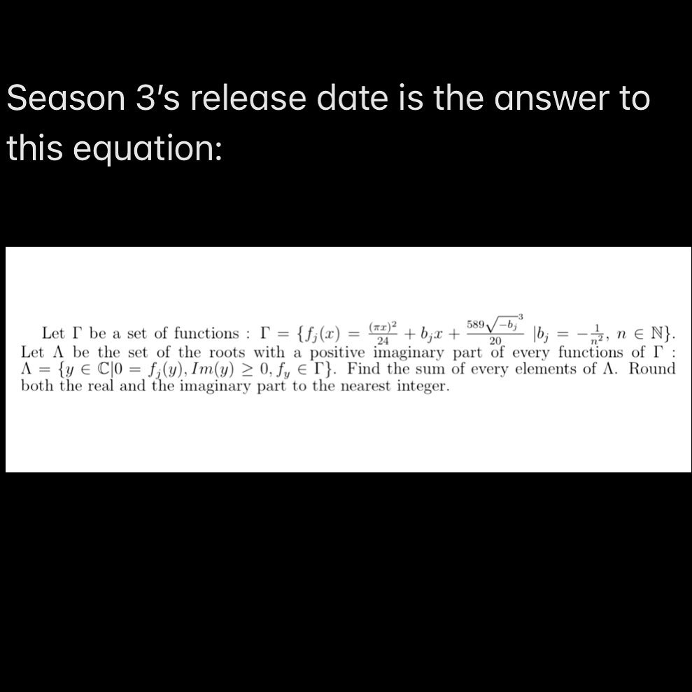

# Purple Hyacinth Release Date Math Problem

On 15 Feb 2022, @deadsophism [posted to Instagram](https://www.instagram.com/p/CaAW1gQlUr3/) the release date of the next season of Purple Hyacinth in classic sadistic Sophism style:

## What Kind of Math Background Do You Need to Solve This?

Roughly highschool and first-year university math knowledge:

* [Highschool-level Algebra](https://www.khanacademy.org/math/algebra)
* [Complex Numbers](https://www.youtube.com/watch?v=T647CGsuOVU)
* [Quadratic Equations](https://www.poshenloh.com/quadraticdetail/)
* [Series (Calculus II)](https://tutorial.math.lamar.edu/classes/calcii/seriesintro.aspx)
* Basic Programming Skills

## An Analytical Solution?

After much simplifying, this is the closest I got to an analytical solution:

I got stuck on how to evaluate the series in the imaginary part by hand ¯\_(ツ)_/¯ 

I ended up used the [Julia programming language](https://julialang.org/) to numerically compute the release date.

## The Release Date

The release date was [anounced](https://www.instagram.com/p/CaDNWRRun1Z/) on 16 Feb 2022
